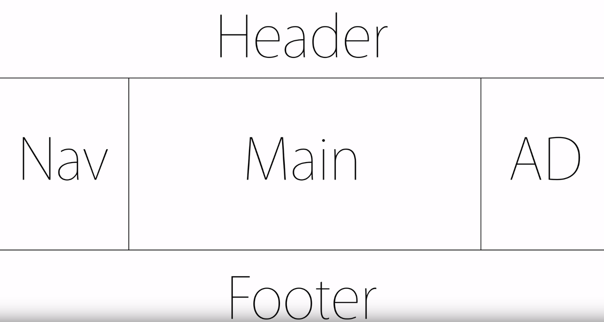

* flex    
    * 참고 사이트 :https://d2.naver.com/helloworld/8540176
    * css가 여러 형태를 거치면서 고안된 table을 그리는 방법
    * flexbox
        1. 뷰포트나 요소의 크기가 불명확하거나 동적으로 변할 때에도 효율적으로 요소를 배치, 정렬, 분산할 수 있는 방법을 제공하는 CSS3의 새로운 레이아웃 방식이다. flexbox의 장점을 한 마디로 표현하면 '복잡한 계산 없이 요소의 크기와 순서를 유연하게 배치할 수 있다'라고 할 수 있다. 정렬, 방향, 순서, 크기 등을 유연하게 조절할 수 있기 때문에 별도의 분기 처리를 줄일 수 있고, CSS만으로 다양한 레이아웃을 구현할 수 있다.
    * float 
        * 이미지에 글씨가 흘러가는 것처럼 하기 위한
    1. 반드시2개의 태그가 필요하다(li 가 ul ol 태그가 필요하듯이)  
       부모에 해당하는 container 태그와 자식역할을 하는 item 태그 필요        
    ~~~
    <container>
        <item></item>
        <item></item> 
    </container>
    ~~~
    * div 
        1. 전체화면을 쓰려는 특성이 있다(block level element)             
  
    * flex의 첫 시작
        1. 가장 바깥쪽에 display:flex 를 주는 것부터 시작
        2. flex-direction 를 통해 방향을 결정한다(row, column)
        3. flex는 기본적으로 direction의 전체 블럭을 사용한다
        * flex-basis
            1. 값은 범위를 나타내며 flex-direction에 따라 결정됨(ex:300px, flex-direction: row)
            2. .item:nth-child(2) : item class에서 두번째 요소
        * flex-shrink
            1. 값 0 : 창을 줄일 때 해당 영역 줄어듬 방지
            2. 값 1 : 창을 줄일 때 해당 영역 같이 줄어듬
            3. 값 1 , 값2 : 각각 값이 다를때 shrink 총 값을 합쳐서 그 값만큼 영역이 줄어든다
        * flex-grow
            1. 값 1 : 각각의 아이템에 grow(커지다) 를 주면 남은 공간을 N빵해서 나눠 가져간다.
            2. 값 2 : 아이템5개 인데 2번째영역만 값이 2이면 전체를 6등분해서 grow 값만큼 남은 영역이 가져간다
    * holy grail layout
          
          
    * 기타 속성들          
        * flex-wrap 
            1. default: nowrap
            2. wrap: container의 크기보다 item들의 합의 크기가 더 크다면 줄바꿈이 되서 아래로 내려간다
        * align-items(수직과 관련된 정렬)
            1. default: stretch  
               flex 속성을 주는 순간 items 들은 container의 높이와 같아 진다 
            2. flex-start: 아이템 자신들이 가지고 있는 값 만큼 영역을 지정
                * start: 처음 기준, end: 마지막 영역기준, center: 중간기준, baseline: 줄맞춤
        * justify-content(수평과 관련된 정렬)
            1. 정렬하고자 하는 상위에 옵션을 할당하면 됨
        * align-content
            1. flex-items은 container 밑에 있는 item 전체를 정렬
            2. align-content는 같은 행을 하나의 그룹으로 쳐서 그룹과 그룹사이의 정렬을 결정해줌
        * Properties for the flex items                
            * 특정 아이템 별로 예외적으로 다른 값을 주고 싶을때 
                    
          
