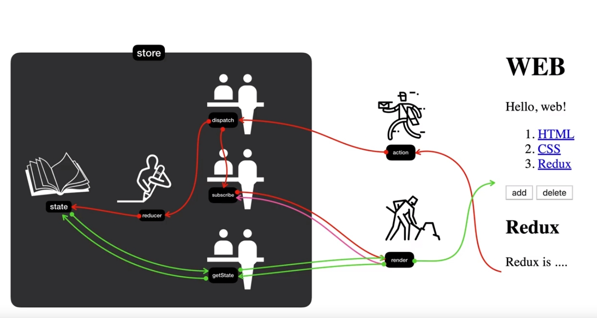

* redux
    * javascript 를 위한 예측가능한 상태 컨테이너
    * 한곳에 app에서 필요한 모든 객체정보를 밀어 넣어 관리한다
    * data 직접 제어 및 조회 불가
        * dispatcher , reducer 통해서만 수정 가능
        * get* 를 통해 조회 가능
    * state가 변경될때마다 각곳에 연락해서 변경하게 해준다. 즉 부품에만 집중하면 된다.
    * 특징 
        1. undo, redo가 쉽다.
        2. 데이터를 수정시 원본을 복제한 것을 수정해서 각자에 독립적이다       
        3. 이전의 상태도 상세히 볼 수 있다.
        4. 핫 모듈 리로딩도 가능(app가 변경해도 데이터는 그대로 남아 있을 수 있다)

* store
    *       
    
* 장점
    1. 중앙 집중적인 데이터 store 를 통해 app를 쉽게 개발 할 수 있다.       