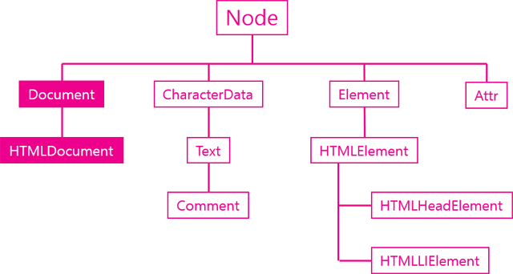

## 웹 브라우저와 자바스크립트
* 강의 URL : https://opentutorials.org/course/1375

* 오리엔테이션
    * 자바스크립트는 HTML과 CSS로 만든 페이지를 동적으로 변경하는데 사용
    * 최근은 DOM을 직접제어 하지 않고 jQuery나 다른것을 사용한다.
    * JS 여러 곳에서 사용
        1. web
        2. node.js
        3. gas
        4. 기타환경에서 
    * 웹 브라우져는 JS로 어떻게 제어하는지 알아볼 예정
    * 공부는 신속하게 개발은 느리게
* 자바스크립트 코드 작성 방식
    * inline 방식
        * 태그에 직접 자바스크립트를 기술 하는 방식
        * 정보와 제어가 섞여있어 정보로써 가치고 떨어진다. 
        ~~~
        정보 제어(onclick) 섞여있음
        <input type="button" onclick="alert('hello world')" value="hello world"/>
        ~~~
      
    * script 방식
        ~~~
        
        ~~~

* 외부 파일로의 분류
    * 특별한 사항이 없으면 body 태그 밑에 넣는걸 추천
    * ~~~
       //정상 처리 load.js가 태그 끝에 삽입되는 형태
      
  </body>
  </html>
  ~~~    
* 보안 
    * 도메인이 같아야 상호작용 할 수 있다.  
    * 팝업
        * 버튼클릭과 같은 사용자 행위를 통한 경우에는 팝업차단이 안걸리지만 화면 로딩과 동시에 팝업을 띄우는경우 브라우져 차단에 걸린다
      
      
* DOM 
    * Document Object Model로 웹페이지를 자바스크립트로 제어하기 위한 객체 모델
    * window 객체의 document 프로퍼티를 통해 사용 가능
        
* 제어 대상을 찾기
    * document.getElementsByTagName
        1. let lis = document.getElementsByTagName('li'); //유사배열 리턴            
        ~~~
          var ul = document.getElementsByTagName('ul')[0]; 
          var lis = ul.getElementsByTagName('li'); //ul 하위에 있는 li 태그 제어
          for(var i=0; lis.length; i++){
              lis[i].style.color='red';   
          }
        ~~~
    * document.getElementsByClassName
    * document.getElementById (단수)
        1. 배열이 아니라 1개만 리턴해 아래와 같이 쓰면된다   
          id.style.color='green';
    * document.querySelector : 1개만 리턴
    * document.querySelectorAll : 모두 담아 유사배열로 리턴 
    
* jQuery
    * 자주 사용하는 로직을 재사용 할수 있도록 고안된 라이브러리
    * 기본 사용법
        1. cdn
        ~~~
        
        <!-- 여기서 //는 실행환경이 http이면 http, https면 https로 실행해줌-->
    * 제어 대상을 찾기       
        * $('li').css('color', 'red'); //<li style="color:red"> 동일
            1. $ -> jQuery 함수, () -> css선택자 
            2. li 태그를 가진 element 전체를 찾는다
            3. .css 찾은 것에 css를 입힌다
            4. . 메소드를 통해 jquery 객체를 리턴함
    * chaining
        * .css().find.().css 이와 같이 찾은 내용에 계속 다른 작업이 수행되는것 말함            
     ~~~
     DOM
     let lis =document.getElementsByTagName('li');
     for(let i=0;i<lis.length;i++){
        lis[i].style.color='red';
     }  
     jQuery
     $('li').css('color', 'red'); //모든 li element
  
     DOM
     let lis =document.getElementsByClassName('.active');
     for(let i=0;i<lis.length;i++){
        lis[i].style.color='red';
     }  
     jQuery
     $('.active').css('color', 'red'); //모든 active class  
  
     DOM
     let id =document.getElementsByClassName('id');
     id.style.color = 'red';
     id.style.textDecoration ='underline'  
     jQuery
     $('#id').css('color', 'red').css('textDecoration', 'underline') //모든 active class  
     ~~~  
* HTML Element
    * HTML 문서 작성시 브라우저는 가장 먼저 태그, 엘리먼트에 대한 객체를 찾고 그 객체에 여러 특징을 부여함
    * HTMLLIElement: getElement* 로 찾은 결과가 1개인 경우
    * HTMLCollection: getElement* 로 찾은 결과가 복수인 경우
    * document.getElementById : 리턴 데이터 타입은 HTMLLIELement
    * document.getElementsByTagName : 리턴 데이터 타입은 HTMLCollection    
    ~~~
  <ul>
      <li>HTML</li>
      <li>CSS</li>
      <li>JavaScript</li>
  </ul>
  <ol>
      <li>HTML</li>
      <li id="active">CSS</li>
      <li>JavaScript</li>
  </ol>
  
  
   ~~~        

*  모든 엘리먼트들은 HTMLElement를 상속 받고 있다
    ~~~           
      interface HTMLLIElement : HTMLElement {
      interface HTMLAnchorElement : HTMLElement {
   ~~~    
    * [HTMLLIElement](https://www.w3.org/TR/2003/REC-DOM-Level-2-HTML-20030109/html.html#ID-74680021)
    * [HTMLAnchorElement](https://www.w3.org/TR/DOM-Level-2-HTML/html.html#ID-48250443)
    * [HTMLInputElement](https://www.w3.org/TR/DOM-Level-2-HTML/html.html#ID-6043025)    
    ~~~
   interface HTMLElement : Element {
              attribute DOMString       id;
              attribute DOMString       title;
              attribute DOMString       lang;
              attribute DOMString       dir;
              attribute DOMString       className;
   };
   ~~~  

* DOM Tree  
  
  
* HTMLCollection
    * 목록이 실시간으로 갱신됨  
    ~~~  
      console.group('before');
      var lis = document.getElementsByTagName('li');
      for(var i = 0; i < lis.length; i++){
          console.log(lis[i]);
      }
      console.groupEnd();
      console.group('after');
      lis[1].parentNode.removeChild(lis[1]); //목록 재조회(getElements*) 필요 없음
      for(var i = 0; i < lis.length; i++){
          console.log(lis[i]);
      }
      console.groupEnd();
    ~~~  
  
    ## 11111111111111111111111
      
* Jquery 객체
    1. jQuery 함수의 리턴값으로 jQuery 함수를 이용해서 선택한 엘리먼트들에 대해서 처리할 작업을 프로퍼티
    2. let li =$('li); //$는 Jquery 함수를 나타낸다
        1. element 객체를 리턴한다
        2. li.css('color', 'red');//암시적으로 li를 반복문을 돌려서 실행한다 
        3. li.css('color'); //뒤에 값이 없으면 현재 색상을 가져온다 rgb(255, 0, 0) 
           단 li 태그가 많으면 첫번째 값을 가지고 옴

* 엘리먼트 정보
    * 유사배열이여서 배열과 같은 방법으로 값을 가져 올 수 있다
    * Jquery 함수를 사용하려면 Jquery 객체를 리턴해야한다 $() 감싸야 함
    ~~~
    let li=$('li');
    //li[0],li[1]
    for(let i =0; i<li.length; i++){
        console.log(li[i].constructor) 
       //ƒ HTMLLIElement() { [native code] }
       //Jquery 객체가 아니라 DOM 객체이다 
       //li[i].css('color', 'red'); //불가능       
       //$(li[i]).constructor.css('color','blue'); //Jquery 로 둘러 쌓여 가능
    }  

* Jquery Element Map    
  ~~~
  let li=$('li');
  li.map(function(index, elem){
      console.log(index, elem);  //li 수만큼 0 <li style=​"color:​ green;​">​html​</li>​
      $(elem).css('color', 'green'); //dom객체를 Jquery 객체로 감싸줌
  })
  ~~~

* Jquery 객체의 API
    * [Jquery API](https://api.jquery.com)
        
* Element 객체
    * let t = document.getElementById('active');  //HTMLELEMENT 리턴
    * ELEMENT
        1. HTMLELEMENT의 부모
        2. DOM은 HTML만을 위한 것이 아니라 마크업 언어를 위한 것으로 SVG, HTML, XML 기타 등등 마크업 언어에서 사용
    * HTMLELEMENT
        1. Style 속성이 있음 
    * 
    * li부터 OBJECT까지 상속관계를 나타냄
    * ; 
    * 특징
        * 식별자: 문서내에서 특정한 엘리먼트를 식별하기 위한 용도로 사용되는 API
            1.Element.classList
            2.Element.className
            3.Element.id
            4.Element.tagName
        * 조회: 엘리먼트의 하위 엘리먼트를 조회하는 API
            1. Element.getElementsByClassName
            2. Element.getElementsByTagName
            3. Element.querySelector
            4. Element.querySelectorAll
        * 속성: 엘리먼트의 속성을 알아내고 변경하는 API
            1. Element.getAttribute(name)
            2. Element.setAttribute(name, value)
            3. Element.hasAttribute(name);
            4. Element.removeAttribute(name);

* 식별자 API
    * ELEMENT.TAGNAME(읽기전용)
        1. HTMLLIELEMENT<-HTMLELEMENT<-ELEMENT 상속 관계를 통해 ELEMENT.TAGNAME 을 사용할 수 있다
        2. TAGNAME은 변경 할 수 없다
    * ELEMENT.id
        1. ID는 단 한번만 등장할 수 있는 식별자        
        2. getElementById로 요소를 가져온 후 x.id='deactive' 아이디를 변경 할 수 있다
    * Element.className 
        1. 사용하기 까다롭다
        2. class는 자바스크립트의 예약어로 속성 className과 일치하지 않는 경우가 있다
        3. 클래스 변경 시 기존의 내역을 확인해야하고 삭제 시 삭제하지 않을 것들의 class를 변경해야한다.
    * Element.classList
        1. classList는 DOMTOKEN으로 유사배열을 리턴한다
        2. classList.add, classList.remove를 통해 class를 제어할 수 있다                       
    ~~~
  <body>
      <ul>
          <li>html</li>
          <li>css</li>
          <li id="active" class="important current">JavaScript</li>
      </ul>
  
  ~~~                
* 조회 API
    * 객체의 조회 범위를 줄이기 위해 document가 아니라 element 객체의 getElementsBy* 메소드를 사용 하면 된다
    * document와 element 객체의 getElement 차이점
        1. document 는 문서 전체를 검색
        2. element는 지정된 노드의 하위를 검색
    ~~~
    <ul>
        <li class="marked">html</li>
        <li>css</li>
        <li id="active">JavaScript
            <ul>
                <li>JavaScript Core</li>
                <li class="marked">DOM</li>
                <li class="marked">BOM</li>
            </ul>
        </li>
    </ul>  
     var list = document.getElementsByClassName('marked');
      console.group('document');
      for(var i=0; i<list.length; i++){
          console.log(list[i].textContent);
      }
      console.groupEnd();
       
      console.group('active');
      var active = document.getElementById('active');  
      var list = active.getElementsByClassName('marked');  //active의 자식만 검색
      for(var i=0; i<list.length; i++){
          console.log(list[i].textContent);
      }
      console.groupEnd();
   ~~~

* 속성 API  
    * Element.getAttribute(name)
    * Element.setAttribute(name, value)
    * Element.hasAttribute(name);  
    * Element.removeAttribute(name);
    
* 속성과 프로퍼티
    * 속성 : target.setAttribute('class', 'important');
    * 프로퍼티 : target.className = 'important'; 
    * 속성과 프로퍼티의 이름과 값이 다를 수 도 있다.  
        1. target.href : http포함 전체주소  
        2. target.getAttribute("href") : 코딩된 내용만 출력 ./demo.html
   * |속성|프로퍼티|
     |---|---|
     |class			|className|
     |readonly		|readOnly|
     |rowspan		|rowSpan|
     |colspan		|colSpan|
     |usemap			|userMap|
     |frameborder	|frameBorder|
     |for			|htmlFor|
     |maxlength		|maxLength|
    ~~~
  

      Hello world
  

  
    ~~~
* jQuery 속성 제어 API  
    * attr(setAttribute, getAttribute에 해당)
    ~~~
  var t = $('#target');
  console.log(t.attr('href')); //http://opentutorials.org
  t.attr('title', 'opentutorials.org'); // title 속성의 값을 설정한다.
  t.removeAttr('title'); // title 속성을 제거한다.
   ~~~
* jQuery 속성과 프로퍼티
    * attr = 속성
    
    * prop = 프로퍼티
    
    * 바닐라 자바스크립트에서는 속성과 프로퍼티가 다른점이 존재했지만 jQuery에서는 이것을 api에서 자동으로 보정해준다. 즉 똑같이 하면 된다
    ~~~
  // 현재 문서의 URL이 아래와 같다고 했을 때
  // http://localhost/jQuery_attribute_api/demo2.html
  var t1 = $('#t1');
  console.log(t1.attr('href')); // ./demo.html 
  console.log(t1.prop('href')); // http://localhost/jQuery_attribute_api/demo.html 
   
  var t2 = $('#t2');
  console.log(t2.attr('checked')); // checked
  console.log(t2.prop('checked')); // true
  ~~~      

* jQuery 조회 범위 제한
    ~~~
      <ul>
          <li class="marked">html</li>
          <li>css</li>
          <li id="active">JavaScript
              <ul>
                  <li>JavaScript Core</li>
                  <li class="marked">DOM</li>
                  <li class="marked">BOM</li>
              </ul>
          </li>
      </ul>
      
      
  ~~             
                    
            
* Node 객체         
    * Node 객체는 최상위 조상으로 모든 DOM은 Node를 상속받음
      
     
    * 객체의 관계를 정의 하는 API 존재
        * 주의사항
            1. html에서 줄 바꿈도 text 객체이다 (#text)
            2. 줄바꿈을 무시하려면 start.firstElementChild 사용하면됨
    ~~~
    <body id="start">
    <ul>
        <li><a href="./532">html</a></li> 
        <li><a href="./533">css</a></li>
        <li><a href="./534">JavaScript</a>
            <ul>
                <li><a href="./535">JavaScript Core</a></li>
                <li><a href="./536">DOM</a></li>
                <li><a href="./537">BOM</a></li>
            </ul>
        </li>
    </ul>
    
  ~~~
  
* 노드 종류 API
    * 각 노드별 노드 타입 key값이나 value로 요소 확인을 할 수 있다
    ~~~
  for(let name in Node){
  	console.log(name);
  };
  key         value
  ELEMENT_NODE 1 
  ATTRIBUTE_NODE 2 
  TEXT_NODE 3 
  CDATA_SECTION_NODE 4 
  ENTITY_REFERENCE_NODE 5 
  ENTITY_NODE 6 
  PROCESSING_INSTRUCTION_NODE 7 
  COMMENT_NODE 8 
  DOCUMENT_NODE 9 
  DOCUMENT_TYPE_NODE 10 
  DOCUMENT_FRAGMENT_NODE 11 
  NOTATION_NODE 12 
  DOCUMENT_POSITION_DISCONNECTED 1 
  DOCUMENT_POSITION_PRECEDING 2 
  DOCUMENT_POSITION_FOLLOWING 4 
  DOCUMENT_POSITION_CONTAINS 8 
  DOCUMENT_POSITION_CONTAINED_BY 16 
  DOCUMENT_POSITION_IMPLEMENTATION_SPECIFIC 32
    ~~~  
  * 실행 예시
    ~~~
    let body=document.getElementById('start')
    
    body.nodeType
    1 //ELEMENT_NODE
    body.firstChild
    #text
    body.firstChild.nodeType
    3 //TEXT_NODE
    document.nodeType
    9 //DOCUMENT_NODE
    body.firstElementChild.nodeType===Node.ELEMENT_NODE //ul
    true
    body.nodeName
    "BODY"
    body.firstElementChild.nodeName
    "UL"    
    ~~~
    
* Node 의 종류 (재귀함수)
    * [repl.it](https://repl.it/@fireyw/jsTest)
    * 함수를 다른 함수의 인자로 전달
    * CALLBACK 함수: 어떤 이벤트가 발생한 후, 수행될 함수를 의미
    ~~~
  <body id="start">
  <ul>
      <li><a href="./532">html</a></li> 
      <li><a href="./533">css</a></li>
      <li><a href="./534">JavaScript</a>
          <ul>
              <li><a href="./535">JavaScript Core</a></li>
              <li><a href="./536">DOM</a></li>
              <li><a href="./537">BOM</a></li>
          </ul>
      </li>
  </ul>
  
  </body>
  ~~~
* 코드 작성 유의 사항
    * 코드 어떻게 활용 될 것인가 고민(사용성, 인터페이스 중점(apple))
    
* 노드의 변경
    * 노드를 추가 및 삭제   
        추가할 element를 생성해야 하는데 이것은 document의 기능
        1. 노드 추가
            * appendChild(child)  
              노드의 마지막 자식으로 주어진 엘리먼트 추가
            * insertBefore(newElement, referenceElement)   
              appendChild와 동작방법은 같으나 두번째 인자로 엘리먼트를 전달 했을 때 이것 앞에 엘리먼트가 추가된다.         
        2. 노드 삭제 : removeChild(child)
        3. 노드 교체 : replaceChild(newChild, oldChild)

* Jquery 노드 변경 
    * DOM 제어가 Jquery 의 주 목적 [Jquery API](https://api.jquery.com/)   
     
    * before, after : 타겟의 형제로 추가
    * prepend, append: 타겟의 자식으로 추가
    * remove : 선택된 element 제거
    * empty : 선택된 element의 노드를 제거

* 문자열로 노드 제어    
    * innerHtml: 자식의 요소를 가져옴, 수정시 자식만 변경
    * outerHtml: 자신을 포함하고 자식 요소를 가져옴 , 수정시 자기까지 변경
    * innerText: 태그를 제외한 문자열을 가져오고, 값을 변경할때 HTML 코드를 그대로 추가(자식만 변경됨)
    * outerText: 태그를 제외한 문자열을 가져오고, 값을 변경할때 HTML 코드를 그대로 추가(부모까지 변경)
    * insertAdjacentHTML: 좀 더 정교하게 노드 변경
        1. beforebegin(동일) : 해당 태그와 같은 레벨 위쪽
        2. afterbegin(자식)  : 해당 태그와 자식 레벨 중 가장 위쪽
        3. beforend(자식)    : 해당 태그와 자식 라벨 중 가장 아래쪽
        4. afterend(동일)    : 해당 태그와 같은 레벨 아래쪽

* Document 객체
    * 
    * Dom의 시작점, window의 객체의 프로퍼티(하위)
        1. createElement()
        2. createTextNode()
    * API
        1. API
        2. title
        3. URL
        4. referrer
        5. lastModified
                    
    ~~~
  
    ~~~
  
* Text 객체  
    
    ~~~
    
Hello world

    

        Hello world
    

    
    ~~~
    ~~~
    <ul>
        <li id="target">html</li>
        <li>css</li>
        <li>JavaScript</li>
    </ul>
    
    ~~~

* 조작 API
    1. appendData()
    2. deleteData()
    3. insertData()
    4.replaceData()
    5. substringData()
    ~~~
  <!DOCTYPE html>
  <html>
  <head>
      
  </head>
  <body>
  
Cording everybody!

  
 data : <input type="text" id="datasource" value="JavaScript" />

  
   start :<input type="text" id="start" value="5" />

  
 end : <input type="text" id="end" value="5" />

  
<input type="button" value="appendData(data)" onclick="callAppendData()" />
  <input type="button" value="deleteData(start,end)" onclick="callDeleteData()" />
  <input type="button" value="insertData(start,data)" onclick="callInsertData()" />
  <input type="button" value="replaceData(start,end,data)" onclick="callReplaceData()" />
  <input type="button" value="substringData(start,end)" onclick="callSubstringData()" />

  
  </body>
  </html>
   ~~~
  
* 문서의 기하학적 특성  
    * getBoundingClientRect: 엘리먼트 크기 및 위치를 알아냄
        1. body 와의 거리를 기준으로 표시해준다
        2. 테두리를 제외한 엘리먼트 크기를 알고 싶다면 ClientWidth, ClientHeight 사용            
    * [실행](http://output.jsbin.com/vuxit/1/)
        
    * ViewPort        
        1. 문서의 내용 중 사용자에게 보여주는 영역
        2. window.pageYOffset : 현재 스크롤 위치
        
    * 스크롤
        1. window.scrollTo : 스크롤 이동
        ~~~
        //viewport의 크기
       console.log('window.innerWidth:', window.innerWidth, 'window.innerHeight:', window.innerHeight);
        //전체 화면 크기
       console.log('screen.width:', screen.width, 'screen.height:', screen.height);
        ~~~

* 이벤트
    * 사용자가 클릭, 스크롤, 필드내용 수정 등등
        1. event Target : input button TAG
        2. event Type : onChange, onClick, onDbClick
        3. event Handler: event가 발생 했을 때 실행되는 코드
        
    * inline        
        * this를 사용하여 간편하게 value 참조 가능
        ~~~
      <input type="button" id="target" onclick="alert('Hello world, '+document.getElementById('target').value);" value="button" />
      <!--this를 통해서 간편하게 참조할 수 있다-->
      <input type="button" onclick="alert('Hello world, '+this.value);" value="button" />
      ~~~
        * 장점
            1. event type을 쉽게 알 수 있다
            2. TAG에 직접 기술되 HTML의 정보로써의 가치를 저하시켜 function으로 빼는게 좋다.
    
    * 프로퍼티 리스너
        * 객체의 프로퍼티로 이벤트 등록           
        * var event = event || window.event; //event가 널이면 window.event 값을 가져오게함
        ~~~
       var t = document.getElementById('target');
          t.onclick = function(event){
              var event = event || window.event; //크로스브라우징 문제해결
              alert('Hello world, '+event.target.value)
          }
        ~~~